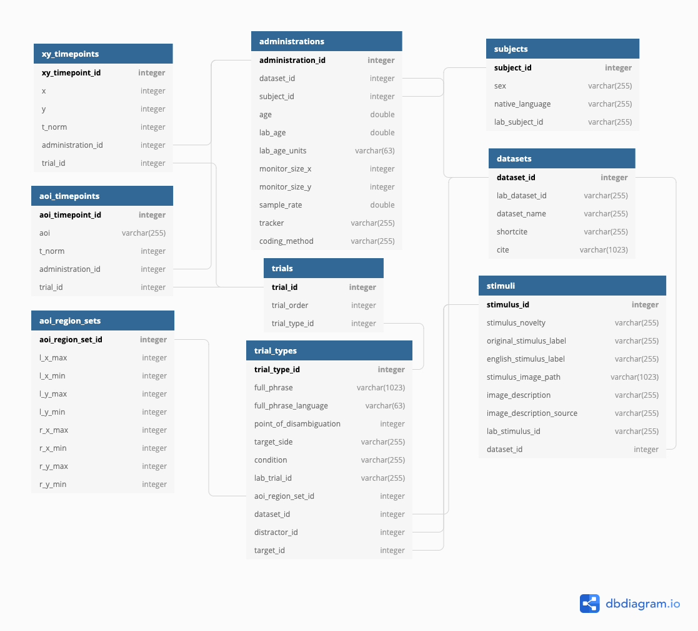

## How Peekbank works

The Peekbank framework has three components:

1. **Processing raw experimental datasets.** Each contributed dataset gets a
   reproducible import script in
   [peekbank-data-import](https://github.com/peekbank/peekbank-data-import)
   that converts the lab's raw eye-tracking exports into the standardized
   *peekds* format: times re-centered so 0 = target-word onset, gaze
   resampled to 40 Hz (25 ms samples), looks coded to areas of interest
   (target / distractor / other / missing). Validators in
   [peekbankr](https://github.com/peekbank/peekbankr) check every table
   against the schema. Raw inputs and processed outputs are archived in the
   [peekbank_files dataset](https://stanford.redivis.com/datasets/frvk-5c922jwkx).
2. **The versioned database.** A release build assigns database-wide ids
   across datasets and publishes the relational tables as a new version of
   the [peekbank dataset](https://stanford.redivis.com/datasets/a3v0-3drqa89kg)
   on Redivis. Every historical release remains available (see
   [Releases](#releases)); Peekbank archives all contributed data,
   including trials and participants the original labs excluded, so users
   can apply their own criteria.
3. **Interfaces.** The [peekbankr](https://peekbank.github.io/peekbankr/) R
   package provides high-level accessors; this site's
   [interactive explorers](accuracy.html) compute standard analyses in your
   browser; and the Redivis pages support queries, previews, and exports in
   any language. See [Data Access](dataaccess.html) for all of these.

## Data schema

Peekbank stores every dataset in a common tidy format so cross-dataset
analyses are easy. Records are linked by numeric ids (arrows below):

- **datasets** — one row per contributed study: citation info, lab metadata
- **subjects** — one row per (de-identified) child; links longitudinal
  sessions
- **administrations** — one experimental session: age at test, coding
  method, tracker and monitor properties
- **stimuli** — word–image pairings, including novelty status
- **trial_types** — the designed trials: target/distractor stimuli and
  sides, carrier phrase, point of disambiguation, condition
- **trials** — the specific trials a child completed, in order
- **aoi_region_sets** — screen-coordinate definitions of the areas of
  interest (eye-tracker datasets)
- **aoi_timepoints** — looks coded to target/distractor/other/missing at
  40 Hz, time-centered on target-word onset
- **xy_timepoints** — raw gaze coordinates at 40 Hz (eye-tracker datasets)

{width=85% fig-align="center"}

## Codebook

Every field in every table, from the team's codebook. Search by table,
field, or description.

```{ojs codebook-data}
//| output: false
codebook = d3.csv("slices/codebook.csv")
```

```{ojs codebook-search}
viewof cb_query = Inputs.search(codebook, {
  placeholder: "Search fields…",
})
```

```{ojs codebook-table}
html`<div style="overflow-x:auto"><table class="pb-plain-table">
  <thead><tr><th>table</th><th>field</th><th>class</th><th>description</th>
  <th>type</th><th>values</th><th>required</th></tr></thead>
  <tbody>${cb_query.map((d) => html`<tr>
    <td style="white-space:nowrap">${d.table}</td>
    <td style="white-space:nowrap"><code>${d.field_name}</code></td>
    <td>${d.field_class}</td>
    <td>${d.description}${d.notes ? html` <span style="color:#9ca3af">(${d.notes})</span>` : ""}</td>
    <td>${d.type}</td>
    <td>${d.values}</td>
    <td>${d["required?"]}</td>
  </tr>`)}</tbody>
</table></div>`
```

## Releases

Peekbank is released in named versions so analyses can be reproduced
exactly; `connect_to_peekbank(db_version = ...)` pins one, and each version
on Redivis carries a `release_info` table naming its release.

| Release | Redivis version | Notes |
|---|---|---|
| **2026.1** | v1.4 | Current release: 44 datasets. Used by Frank et al. (2026), *eLife* and Boyce et al. (2026). |
| 2025.2 | v1.3 | Incremental update to 2025.1. |
| 2025.1 | v1.2 | Reproduces the preprint of [Frank et al., *eLife*](https://elifesciences.org/reviewed-preprints/109636). |
| 2022.1 | v1.1 | Citable version for [Zettersten et al. (2023), *BRM*](https://doi.org/10.3758/s13428-022-01906-4); identical data to 2021.1. |
| 2021.1 | v1.0 | Initial release, for [Zettersten et al. (2021), *CogSci*](https://psyarxiv.com/ep693). |

For heavy local use, download whole tables from the
[Redivis dataset page](https://stanford.redivis.com/datasets/a3v0-3drqa89kg)
(exports to parquet/CSV) or via the clients — the MySQL-era
`mysqldump` instructions are obsolete.

## Getting started

The fastest route is the [Data Access](dataaccess.html) page: install
peekbankr, connect, and pull tidy tables in a few lines. For a guided tour
of the analyses these data support, open any page in the *Analyses* menu —
every plot has a Data tab with a CSV download of exactly what is shown.
