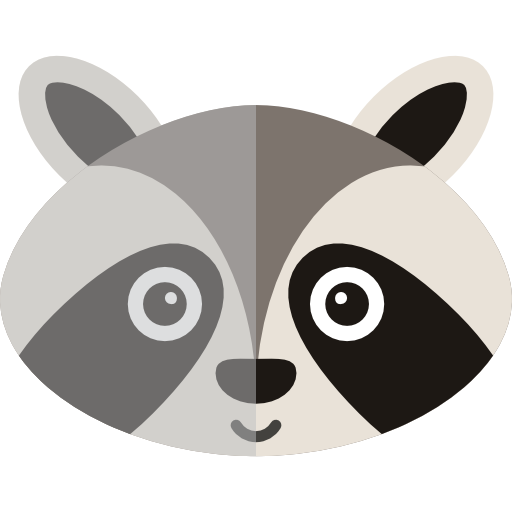

```{=html}
<div class="pb-hero">
  
  <div>
    <div class="pb-title" role="heading" aria-level="1">Peekbank</div>
    <p>An open database of infant looking-while-listening data</p>
  </div>
</div>
```

```{ojs stats}
//| output: false
manifest = d3.json("slices/manifest.json")
totals = ({
  datasets: manifest.datasets.length,
  admins: d3.sum(manifest.datasets, (d) => d.n_admins),
  subjects: d3.sum(manifest.datasets, (d) => d.n_subjects),
  trials: d3.sum(manifest.datasets, (d) => d.n_trials),
})
```

```{ojs stats-line}
html`<div class="pb-stats">Peekbank release ${manifest.version} contains
${totals.datasets} datasets: ${totals.subjects.toLocaleString()} children,
${totals.admins.toLocaleString()} test sessions, and
${totals.trials.toLocaleString()} experimental trials.</div>`
```

<div style="text-align:center; margin: 1.2rem 0 2rem 0;">
<a class="pb-cta" href="accuracy.html">Explore the data →</a>&nbsp;&nbsp;
<a class="pb-cta" style="background:#e5e7eb; color:#111827 !important;" href="https://peekbank.github.io/peekbank-website/">Documentation ↗</a>
</div>

## What is Peekbank?

The Peekbank project aggregates eye-tracking data from studies of children's
word recognition using the looking-while-listening paradigm: children see two
pictures and hear a sentence naming one of them, and their gaze reveals how
quickly and accurately they recognize the word. Individual studies are small;
pooled in a common format, they let us map the developmental trajectory of
word recognition across ages, items, and languages.

This site provides interactive, in-browser visualizations of the current
database release. For documentation, data access via the
[peekbankr](https://github.com/peekbank/peekbankr) R package, and information
about contributing a dataset, see the
[main Peekbank site](https://peekbank.github.io/peekbank-website/).

## Datasets at a glance

```{ojs mini-table}
Inputs.table(
  manifest.datasets.map((d) => ({
    dataset: d.name,
    citation: d.shortcite,
    children: d.n_subjects,
    sessions: d.n_admins,
    "age range (mo)": `${d.age_min}–${d.age_max}`,
    languages: d.languages.join(", "),
  })),
  { maxHeight: 500 }
)
```
